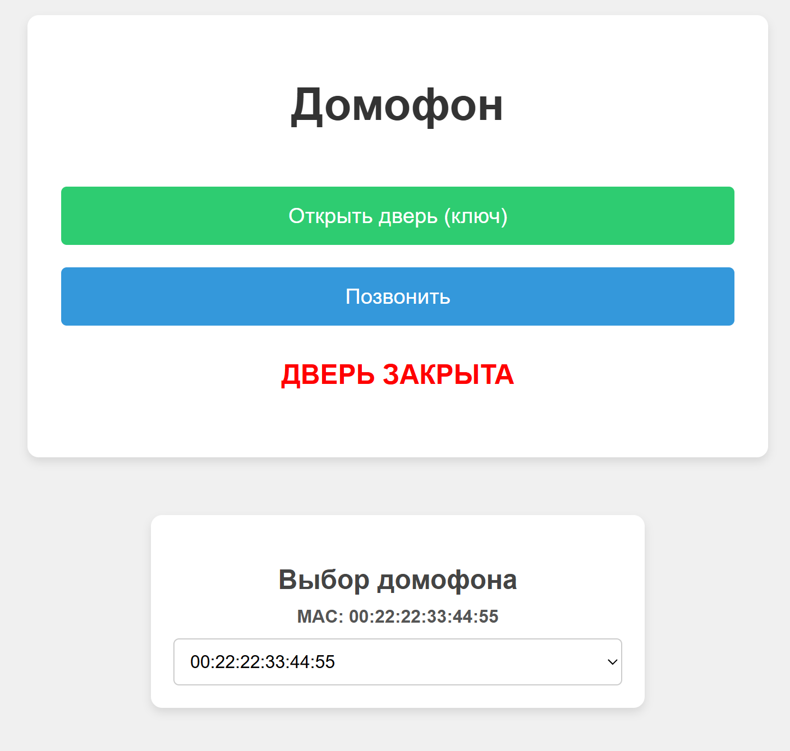
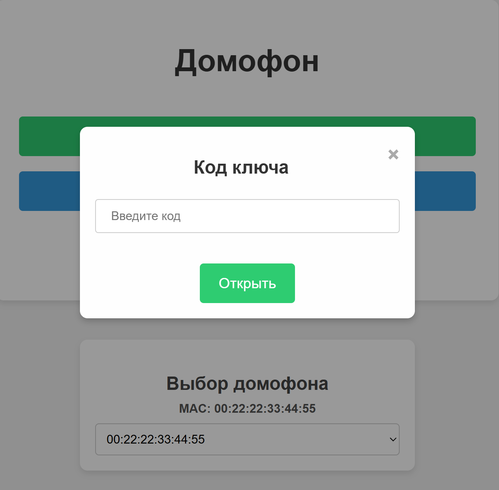
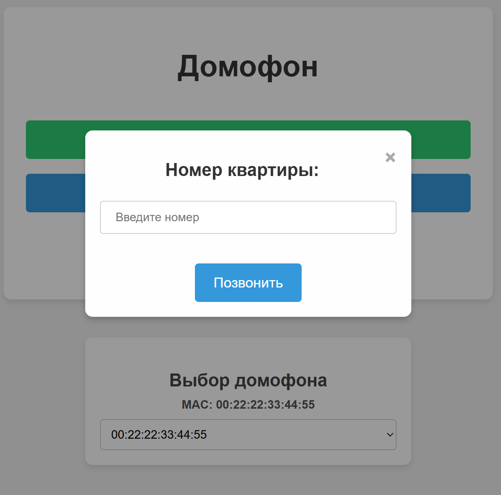
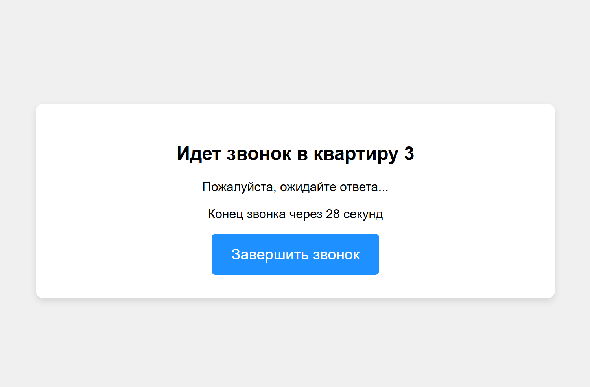
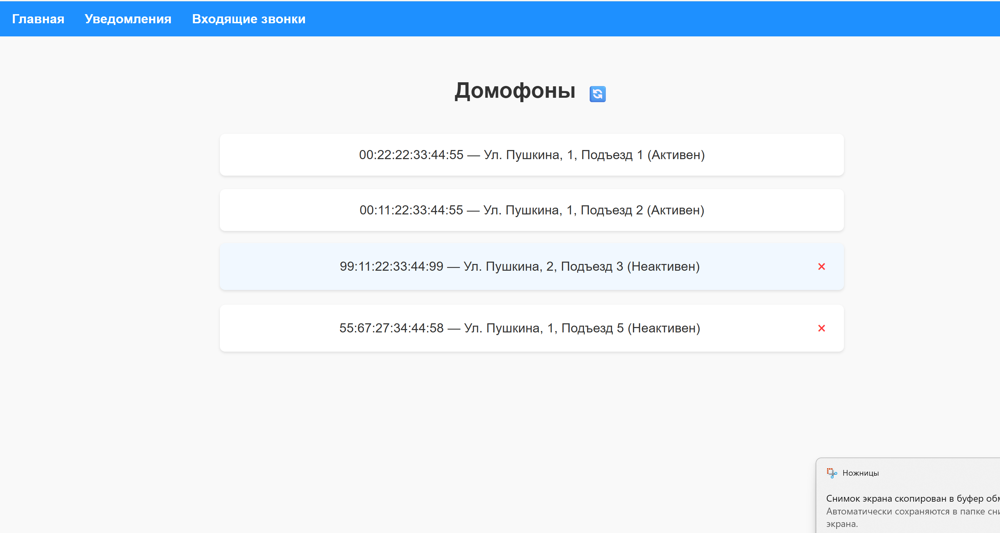
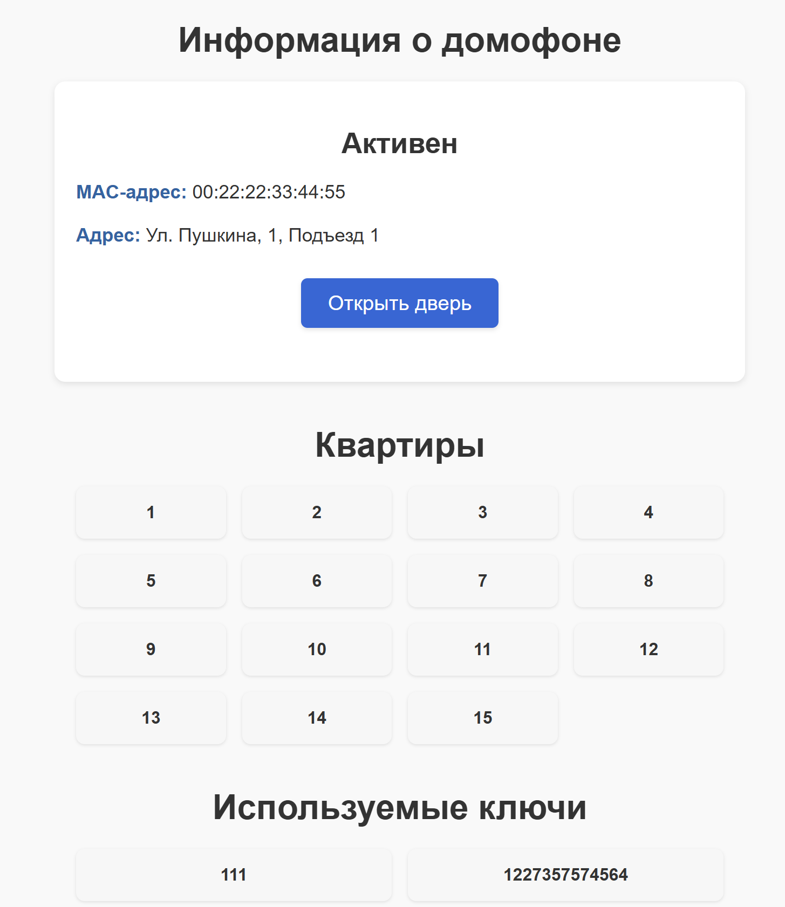
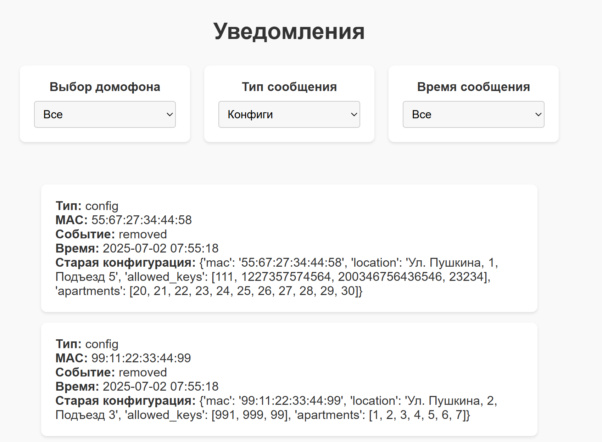
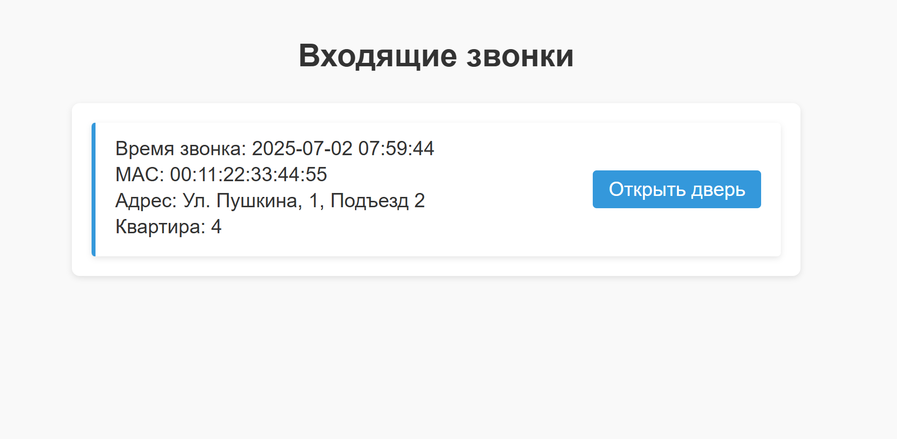

Основной проект, включает микросервис домофонов

Для работы также требуется микросервис уведомлений и управления, его можно установить по ссылке: "https://github.com/TiredGit/MQTT_notifications" и затем разместить в той же папке, где находится папка данного проекта

Микросервис домофона:
Позволяет выбирать домофон по mac, открыть дверь ключом (ключ вводится и проверяется), совершить звонок (в определенную квартиру, ввод проверяется). Также отображается текущий статус двери (открыта или закрыта)
Домофоны связаны с микросервисом уведомлений и управления через MQTT и отправляют туда различные сообщения: каждые 10 секунд статус домофона, сообщения об открытии или закрытии двери, сообщение об совершении звонка или использовании ключа и т.д.
Чтобы добавить домофон его надо поместить в папку doorphones, чтобы отключить - удалить его из этой папки. В папке doorphones_examples находятся дополнительные готовые домофоны

Главная страница:

Открытие двери ключом:

Звонок:

Процесс звонка:

Микросервис уведомлений и управления:
Просмотр домофонов: активных и неактивных (неактивные - те, которые были отключены, но информация о них сохранилась). Информацию о неактивных домофонах можно удалить.
Реализовано сохранение приходящих из MQTT сообщений в Clickhouse, также возможен их просмотр с фильтрами типа уведомления, времени и мак-адреса.
Имеется возможность просмотра информации об конкретном домофоне, а также открытия двери через него.
Кроме того, через вкладку "Входящие звонки" возможно ответить на звонок, открыв дверь

Главная страница:

Страница домофона:

Страница уведомлений:

Страница входящих звонков:
